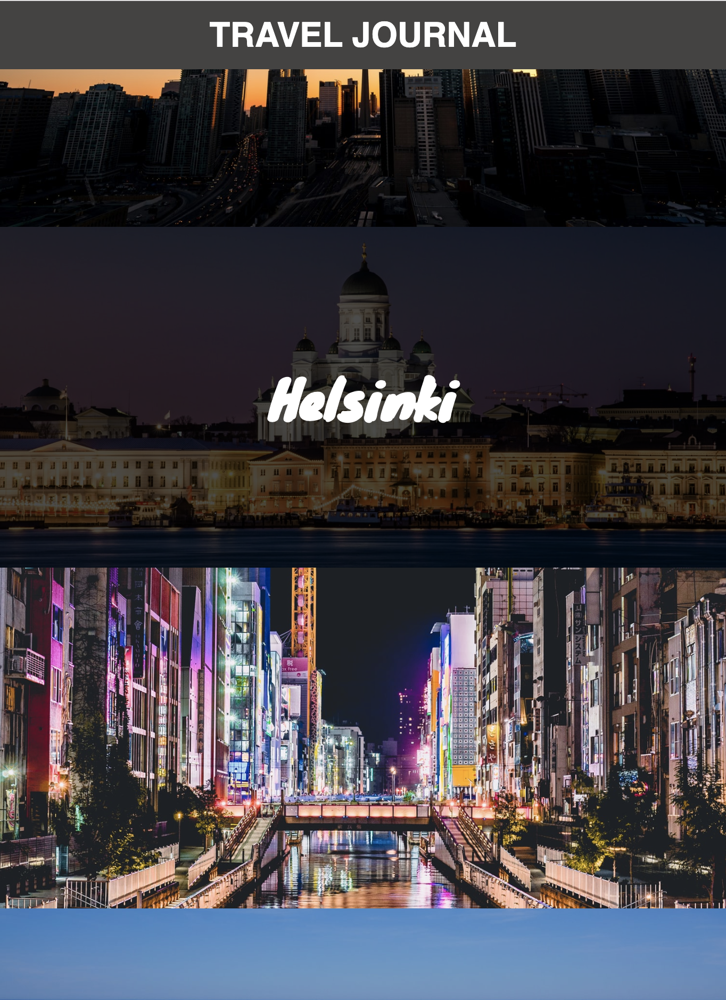

# Travel Journal

Practicing `position`, `grid` and other concepts to create an app-like interface with HTML and CSS.

## Task

Using this project starting markup in `index.html` and complete the styling in `index.css`. Note there is a *reset* css document attached, but feel free to use *normalize* or other style-standardizing methods. 

Setup each `<article>` so its `h2` uses a custom ("fun") font and is centered (vertically and horizontally) over top of its respective image, within a *modal* type cover over the image. When hovered over, each `<article>` will reveal its heading using a `transition`.

All `<article>` elements should be the same `height`, meaning `` may be cropped using `overflow`. Ensure that each `` is cropped in a way that best represents the photo’s primary subject or focus.  Each `<article>` should take up the entire width of the viewport (mobile style layout), but can be expanded to be fully responsive at all viewport sizes.

At the top of the document is a `fixed` heading bar that should always be over-top of all subsequent document content.

## Sample

An example of the page in mid-scroll, with a mouse-ove hover style shown for the city of Helsinki.

